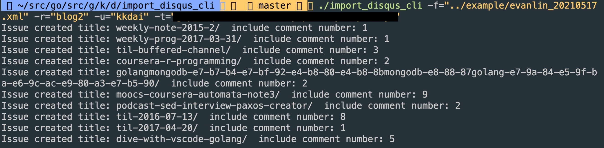
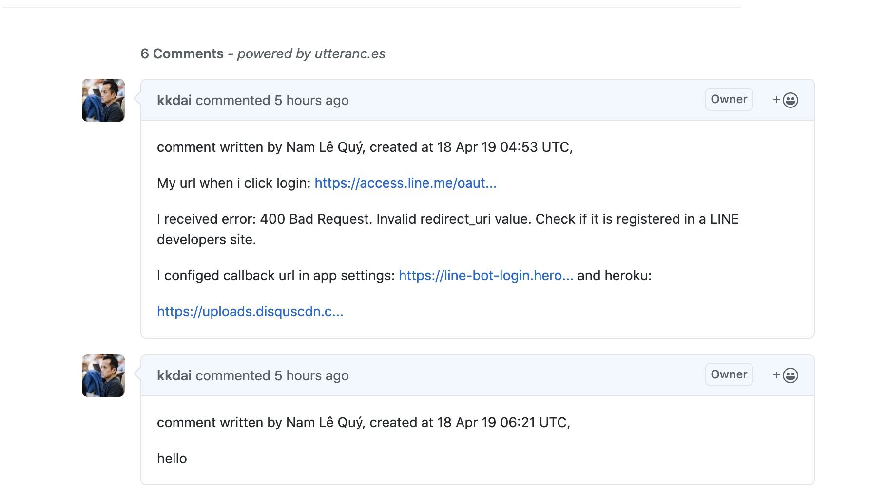

# disqus-to-github-issues-go:  Import your disqus comments into github issue in Go.

 [](https://godoc.org/github.com/kkdai/disqus-to-github-issues-go)  


# How to usee it?

```
go get github.com/kkdai/disqus-to-github-issues-go
```

Write your own CLI tool, or just use.

```
go install github.com/kkdai/disqus-to-github-issues-go/cmd/import_disqus_cli
```

# How to use it?

Here is the parameter of `import_disqus_cli`.

- `-f`: Import disqus exported xml file. (get from <http://disqus.com/admin/discussions/export/>)

- `-u`: github user name, you want to use for post github issue.

- `-r`: github repo name, you want to use for post github issue.

- `-t`: github token, you can request your from <https://github.com/settings/tokens>.


# Result


How it works in my blog. <https://www.evanlin.com/>



License
---------------

Licensed under the Apache License, Version 2.0 (the "License");
you may not use this file except in compliance with the License.
You may obtain a copy of the License at

http://www.apache.org/licenses/LICENSE-2.0

Unless required by applicable law or agreed to in writing, software
distributed under the License is distributed on an "AS IS" BASIS,
WITHOUT WARRANTIES OR CONDITIONS OF ANY KIND, either express or implied.
See the License for the specific language governing permissions and
limitations under the License.

